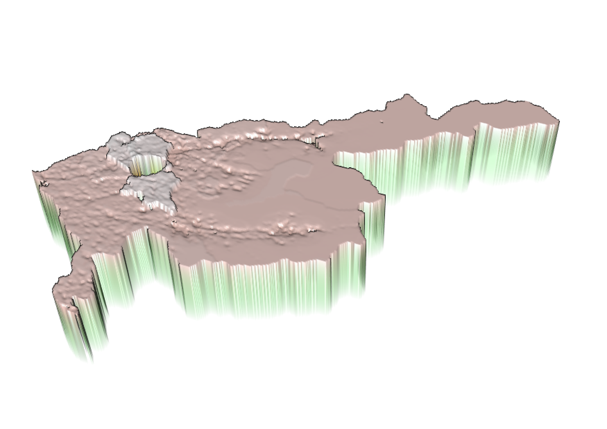

# Project 2

## Acquiring the Data and Designing the Predicitive Model

I began by accessing the WorldPop dataset to combine 12 different covariate layers to help predict population distribution in the Tashkent and Tashkent City regions of Uzbekistan. The layers included topography, nighttime lights, land use, land cover, slope, and water systems, all of which were collected in 2015. I overlayed the layers into a single raster file, which I then regressed against the 2019 population distribution of those regions. 

The R-squared value of 0.91 suggested strong positive correlation between the layered variables and the population density counts, but the p-value of 0.2 was well above the range of stastical significance. Many other projects had p-values entire orders of magnitude closer to 0, and I can only hypothesize the difference being caused by drastic changes in Uzbekistan's population densities in recent years. Urbanization has recently taken off in lower-income countries, so the data I used in 2015 would sensibly fail to predict the large shift towards urban centers found nearly half a decade later.

## Comparing Model Predictions to Actual Values

Accounting for the time discrepancy between the collection of the data layers and the most recent population distribution estimate, it makes sense that my model drastically under-predicted the population counts near Tashkent City, an urban center. Below are two images: i) epicting the inaccuracy of a mdoel based on the summation of data cells within each region, and ii) depicting the inaccuracy of a mdoel based on the mean value of data cells within each region.

