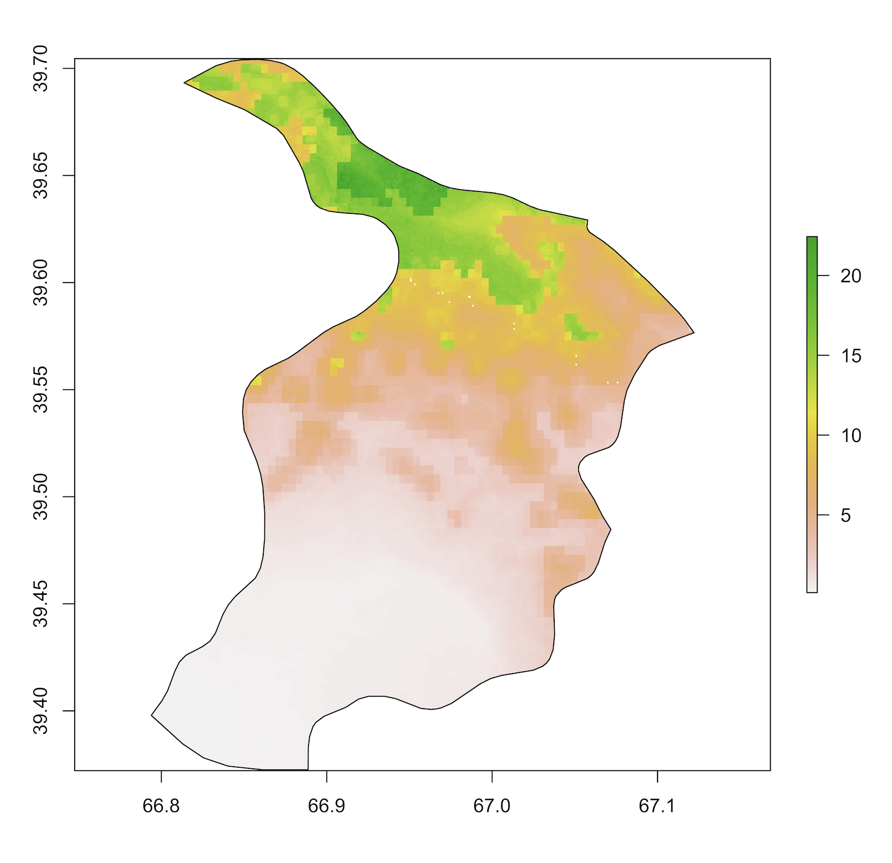
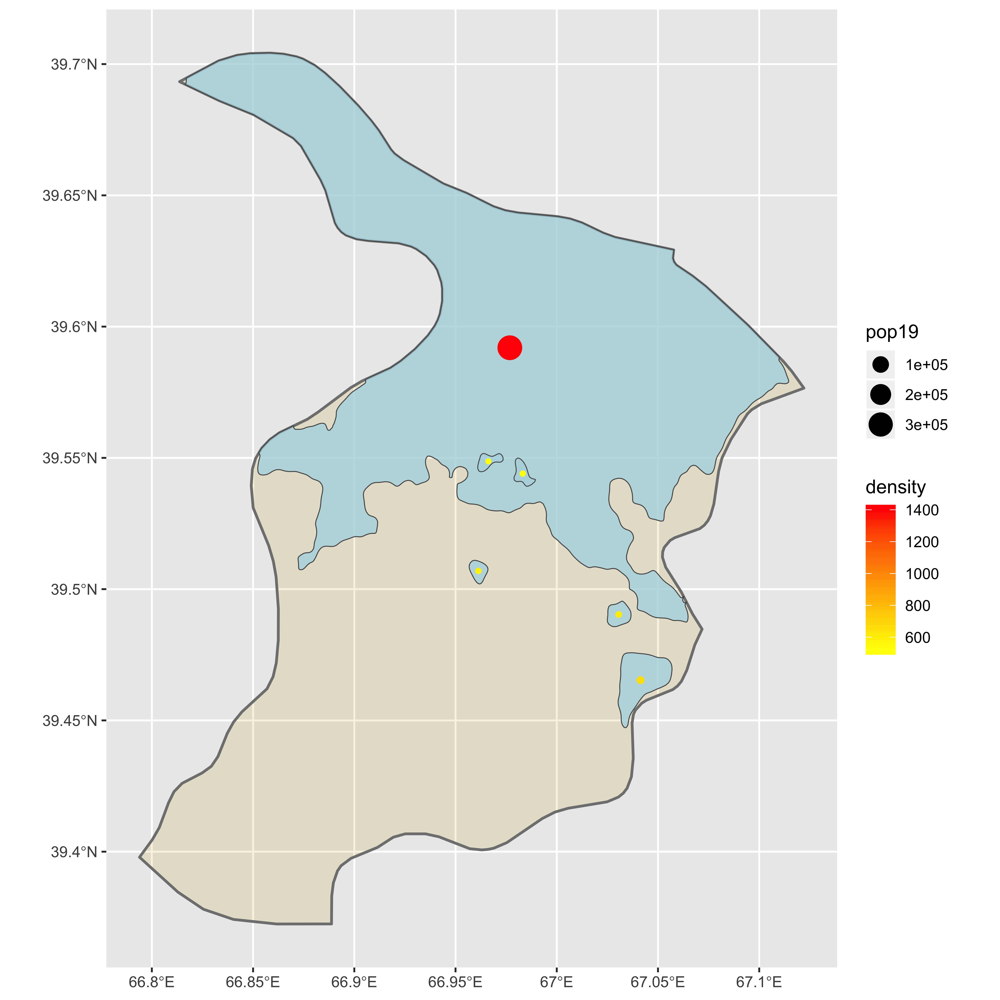
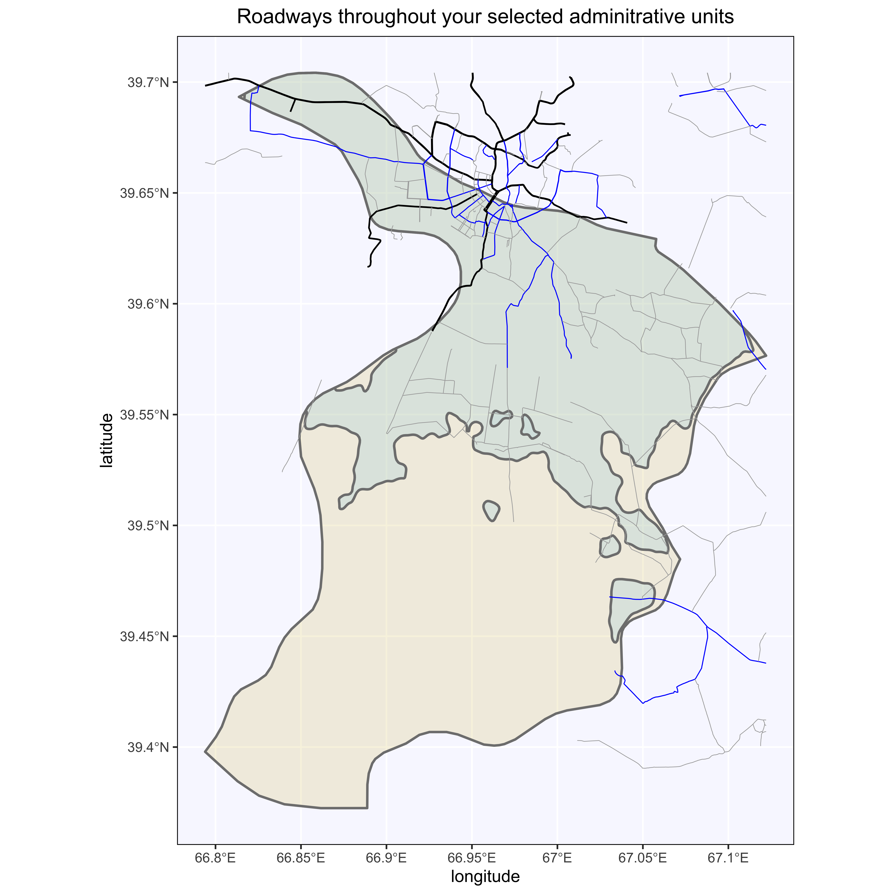

# Project 3

## Identifying Urban Areas in the Samarqand Adminstrative Subdivision of Uzbekistan

I began this project by breaking down the population distribution of Samarqand, a 2nd-level administrative suvdivision of Uzbekistan. Pictured below is the persons-per-pixel graph of the population distribution. As one can see, there is an intense cluster in the upper half of the district, which corresponds to the location of a major Uzbek city: Samarkand.

Pictured below, I then utilized a density function to map the continuous intensity map of the population dsitribution described in the previous image. I drew contour lines for a baseline, ad-hoc number of 5 million people to focus on various urban centers within the larger district, which are layered on top of the picture below.

I then filtered out any resulting urban-center polygons with population counts and densities that were below a specified value. Finally, I labeled each remaining urban center with a centralized dot to represent its equally-distributed population count and density. The larger the dot, the higher the population count, and the more red the dot, the higher its density is. As one can see, there is one predominant urban center in the entire district that is triple the others' population counts and far more dense than the others.

## Stacking Road and Health Infrastructure Layers to Map Visual

To complete the project, I first used the HDX data on Uzbekistan's transportation facilities, overlaying and cropping the shapefile onto the Samarqand district. The resulting road map (pictured below) contains all the major roadways that run into Samarqand. Primary roads are pictured in black, secondary in blue, and tertiary in gray. Note how almost no main roadways run beyond the urban center I identified.

Finally, I overlayed HDX data on health care facilities in the district (pictures below). These facilities, similar to the road network, clump around the major urban area that I had identified. Beyond the reaches of that major center, however, there are few to no other facilities, let along roads to provide access to them.

