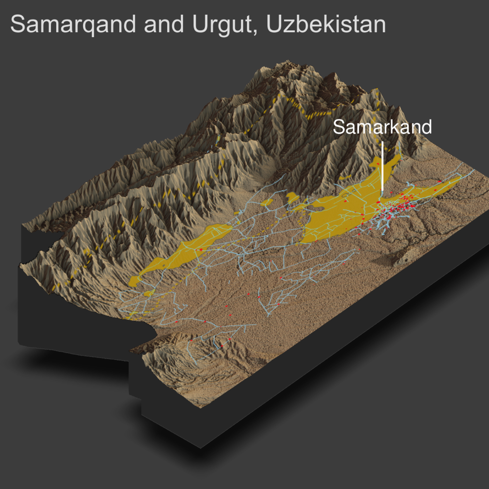

# Project 4

## Topographical Impact on Human Development

I began this project by using my plot from Project 3, which mapped the major roadways, healthcare facilities, and urban areas within the Samarqand district of Uzebekistan. I grew the map to also include the neighboring administrative district Urgut. Pictured below is the rendered image of the combined maps. Note that the dotted yellow line is the border surroudning both Samarqand and Urgut; the reason that some roads are depicted outside of the border is due to the fact that the map plots all roads that enter each district, with some continuing on to neighboring districts.

As one can see, there appears to be a desert of roads and healthcare facilities about halfway down each district. True, these developments lie predominantly in the highlighted urban areas (high population and population density), but it is still strange not to see even a small overspill of road and health facility development into the rural areas. To help explain this anamoly, I acquired the topographical data of these regions, and overlayed my combined map onto a 3D rendered graphic of the topography (pictured below). *Note: the orientation is for visual convenience, not necessarily directionally correct*.

It is clear to see with the above map that the geographical features of this region do a a lot to explain the lack of development in half of both Samarqand and Urgut. The road networks and healthcare facility distribution seem to dissipate as soon as one reaches the mountains. As discussed in class and proven many times over in numerous research studies, physical geography continues to be one of the most driving charactersitics in explaining human development distributions.
