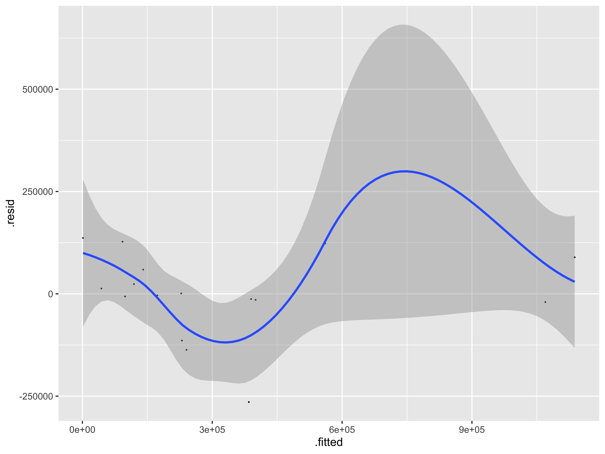
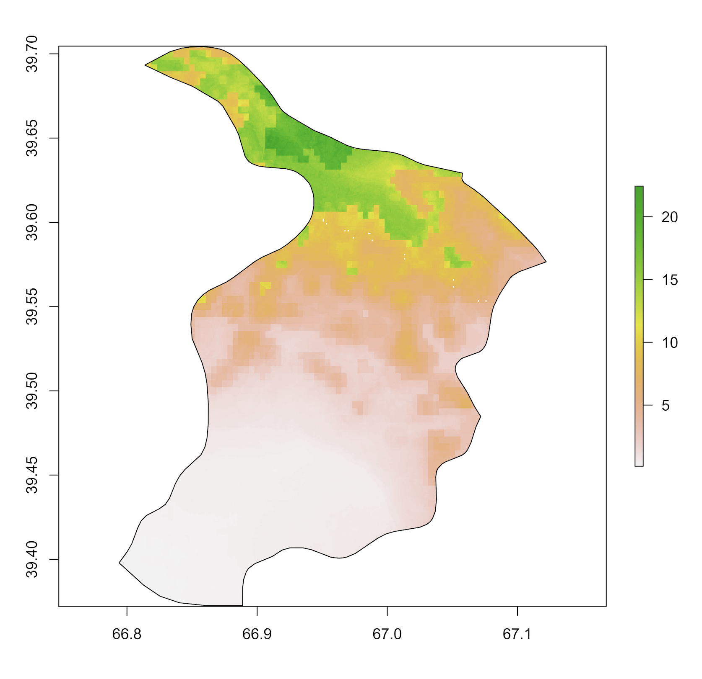
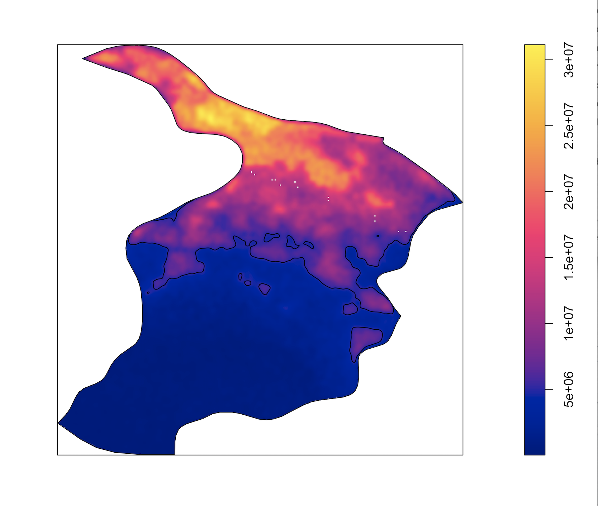
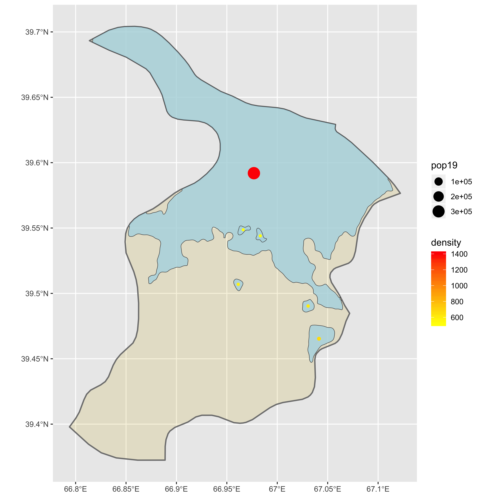
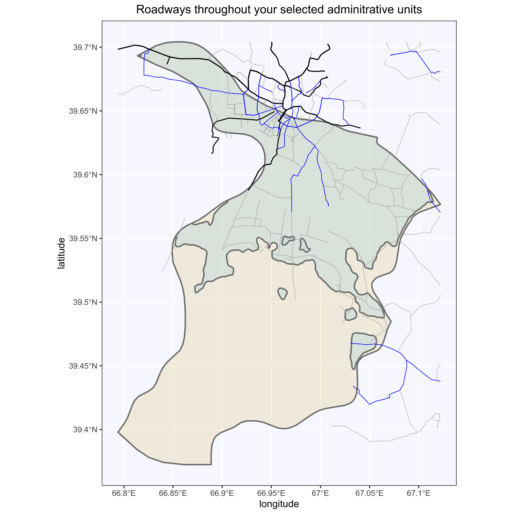
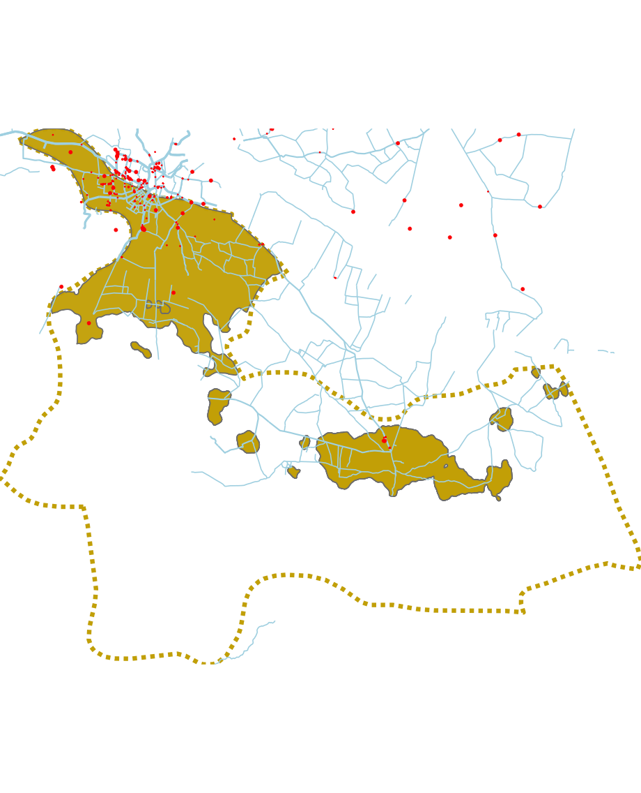

# Final Project

Conor Sokolowsky

## Administrative Subdivisions of Uzbekistan

I chose to focuse my exploration of geographic population distribution on Uzebkistan, a middle-income, land-locked country in Central Asia. I mainly chose this country due to my family's ties to the region, and I wanted to familiarize myself with the area. Uzbekistan is divided into 12 provinces, one autonomous republic (Qaraqalpaqstan), and one autonomous city (Tahkent City), which makes it a unique case study. There also exist 163 2nd-level adminstrative subdivisions within these provinces, along with a number of towns, villages, and other settlements. Below is a high-resolution image of Tashkent's administrative borders and subdivisions. Highlighted in Detail A is Tashkent, one of the most populous administrative districts in Uzbekistan. Within Tashkent lies the autonomous City of Tashkent, the capital of Uzbekistan, which is highlighted in a close-up image of Detail A.

## Tashkent Population Distribution

Below is the population distribution of the combined region of both Tashkent and Tashkent City, sorted by each second-level adminsitrative subdivision. Note that although Tashkent City is a large urban district with a high population density, the total population count of some rural districts are still larger than its total population count. This phenomenon is due to the fact that Uzbekistan still has a large rural population (with low population density), something that will rapidly change with the rise of global urbanization. Additonally, the bar graph demonstrates the percent population breakdown of Tashkent's administrative subdivisions, providing further/more usable insights into the population distribution.

## Acquiring the Data and Designing the Predicitive Model

The next step in my cumulative project required me to create a random-forest model to predict the population distribution in Tashkent and Tashkent City. I began by accessing the WorldPop dataset to combine 12 different covariate layers, which are essentially the variables that I identified as being important in predicting human distribution patterns. The layers included topography, night-time lights, land use data, land cover, slope, and water systems, all of which were collected in 2015. I overlayed the layers into a single raster file, which I then regressed against the 2019 population distribution of those regions.

The R-squared value of 0.91 suggests strong positive correlation between the layered variables and the population density counts, but the p-value of 0.2 is well above the range of stastical significance. Many other projects done by my peers had p-values entire orders of magnitude closer to 0, and I can only hypothesize the difference being caused by drastic changes in Uzbekistan's population densities in recent years. Urbanization has recently taken off in lower-income countries, so the data I used in 2015 would sensibly fail to predict the large shift towards urban centers found nearly half a decade later. Depicted below is my regression analysis between the population distribution and the raster stack file.

## Comparing Model Predictions to Actual Values

Accounting for the time discrepancy between the collection of the data layers and the most recent population distribution estimate, it makes sense that my model drastically under-predicted the population counts near Tashkent City, an urban center. Below are two images: i) epicting the inaccuracy of the model based on the summation of data cells within each region, and ii) depicting the inaccuracy of the mdoel based on the mean value of data cells within each region. The absolute value of the total differences between the sum model estimates and the actual popualation count was 5,622,991, while the means model had a far worse output of 130,669,997.

## Identifying Urban Areas in the Samarqand Adminstrative Subdivision of Uzbekistan

In the next phase in my project, I utilized existing population distribution data to identify urban areas. I chose to use the district of Samarqand, a 2nd-level administrative suvdivision of Uzbekistan, in this portion of the project, because its geographic area is smaller than the unionized Tashkent/Tashkent City region and thus easier to work with on my laptop. I first broke down the population distribution of Samarqand. Pictured below is the persons-per-pixel graph of the population distribution. As one can see, there is an intense cluster in the upper half of the district, which corresponds to the location of a major Uzbek city: Samarkand.

Pictured below, I utilized a density function to map the continuous intensity map of the population dsitribution described in the previous image. I drew contour lines for a baseline, ad-hoc number of 5 million people to focus on various urban centers within the larger district, which are layered on top of the picture below.

I then also filtered out any resulting urban-center polygons with population densities below a specified value. Finally, I labeled the remaining urban center with dots that represented the equally-distributed population count and density of that urban area using a gradient-based scale. The larger the dot, the higher the population count, and the more red the dot, the higher its density is. As one can see, there is one predominant urban center in the entire district that is several times more populous and dense than the other highlighted areas.

## Stacking Road and Health Infrastructure Layers to Map Visual

I first used the HDX data on Uzbekistan's transportation facilities, overlaying and cropping the shapefile onto the Samarqand district. The resulting road map (pictured below) contains all the major roadways that run into Samarqand. Primary roads are pictured in black, secondary in blue, and tertiary in gray. Note how almost no main roadways run beyond the main urban center I identified.

Next, I overlayed HDX data on health care facilities in the district (pictures below). These facilities, similar to the road network, clump around the major urban area that I had identified. Beyond the reaches of that major center, however, there are few to no other facilities, let along roads to provide access to them.

## Topographical Impact on Human Development

I began this final part of the project by using my plot from above, which mapped the major roadways, healthcare facilities, and urban areas within the Samarqand district of Uzebekistan. I grew the map to also include the neighboring second-level administrative district, Urgut. Pictured below is the rendered image of the combined maps. Note that the dotted yellow line is the border surrounding both Samarqand and Urgut; the reason that some roads are depicted outside of the border is due to the fact that the map plots all roads that enter each district, with some continuing on to neighboring districts. The healthcare facilities along each of these "spill-over" roads are then also plotted by default.

As one can see, there appears to be a desert of roads and healthcare facilities about halfway down each district. True, these developments lie predominantly in the highlighted urban areas (high population and population density), but it is still strange not to see even a small overspill of road and health facility development into the rural areas. To help explain this anamoly, I acquired the topographical data of these regions, and overlayed my combined map onto a 3D rendered graphic of the topography (pictured below). *Note: the orientation is for visual convenience and is not necessarily directionally correct*.

It is clear to see with the above map that the geographical features of this region do a a lot to explain the lack of development in half of both Samarqand and Urgut. The road networks and healthcare facility distribution seem to dissipate as soon as one reaches the mountains. As discussed in class and proven many times over in numerous research studies, physical geography continues to be one of the most driving charactersitics in explaining human development distributions.

### Sources

https://www.nationsonline.org/oneworld/map/uzbekistan-administrative-map.htm

https://www.un.int/uzbekistan/uzbekistan/country-facts
